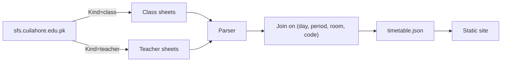

# CUI Lahore Timetable Planner

[](https://github.com/umair363/cui-lahore-timetable-planner/actions/workflows/scrape.yml)
[](LICENSE)
[](https://umair363.github.io/cui-lahore-timetable-planner/)

A course-planning tool for COMSATS University Islamabad, Lahore Campus, built on top of
the university's own public timetable data. It reconstructs a complete, queryable
schedule — course, section, teacher, room, and time in one record — that the official
site cannot produce on its own, and ships a fast static app on top: search, per-course
and per-teacher browsing, a clash-detecting planner, and automatic clash-free schedule
generation.

**Live site:** https://umair363.github.io/cui-lahore-timetable-planner/

---

## The problem

The [official timetable](https://sfs.cuilahore.edu.pk/schedule/Public/Timetable) renders
one class section or one faculty member per page, and the two views are incomplete in
opposite directions: a class sheet never states the teacher, and a teacher sheet never
states the class. There is no page on the official site that answers a question as
simple as *"who teaches CSC316, and when does it meet?"*

## The approach

Both views are scraped, parsed, and rejoined. A lesson is uniquely identified by
`(day, period range, room, course code)`; matching that key across the class-side and
teacher-side data recovers the missing half of each record. On the current dataset this
resolves 91.6% of lessons exactly, with the remainder — mostly large introductory
courses split across many instructors — reported honestly rather than guessed at (see
[Data integrity](#data-integrity)).



The result is republished on a schedule, so the data stays current without manual
intervention.

## Features

| | |
|---|---|
| **Search** | One box across course titles, codes, teachers, sections, and rooms. |
| **Course view** | Every offering of a course, across every section — teacher, room, day, time. |
| **Faculty view** | A teacher's full week and every section they teach. |
| **Section view** | A section's week, with per-lab-group previews. |
| **Planner** | Select offerings, see a live week grid, clashes flagged immediately, shareable by link. |
| **Auto-build** | Load a section's course list, pin or open up each course's section/lab group, and generate every clash-free combination, ranked and previewed as a real timetable. |
| **Swap finder** | For any course already in your plan, every alternative that still fits the rest of it. |
| **Installable / offline** | A full PWA - installs to your home screen or desktop, and after one visit the app shell and last-known data both work with no connection. |

## Project structure

```
scraper/
  parser.py          HTML grid → structured lesson blocks (stdlib html.parser only)
  join.py             class ↔ teacher join, with an integrity report
  scrape.py            crawl orchestration → docs/data/timetable.json
  test_parser.py + fixtures/   tests against real captured pages
docs/
  index.html, styles.css, app*.js    the static site (no build step, no framework)
  data/timetable.json                 the published dataset
.github/workflows/scrape.yml         scheduled re-scrape and auto-commit
```

## Tech stack

- **Scraper:** Python 3, standard library only (`urllib`, `html.parser`,
  `concurrent.futures`). No third-party dependencies, so the pipeline has nothing to
  break when a package updates.
- **Frontend:** vanilla HTML/CSS/JavaScript, no build step, no framework.
- **Hosting:** GitHub Pages, served from `/docs`.
- **Automation:** GitHub Actions, on a cron schedule.

## Getting started

Requirements: Python 3.10+. No other dependencies.

```bash
git clone https://github.com/umair363/cui-lahore-timetable-planner.git
cd cui-lahore-timetable-planner

# Run the scraper (full crawl takes ~5 minutes)
cd scraper
python scrape.py
python -m unittest test_parser -v

# Serve the site locally
cd ../docs
python -m http.server 8000
# open http://localhost:8000
```

Useful flags on `scrape.py`:

| Flag | Effect |
|---|---|
| `--limit N` | Smoke-test crawl: only the first N classes and teachers. |
| `--no-gate` | Write output even if the sanity gate would reject it (inspection only — never for publishing). |
| `--cache-dir DIR` | Reuse cached HTML from a previous run. |

## Deployment

1. Push the repository to GitHub.
2. **Settings → Pages** → Source: *Deploy from a branch* → select the default branch and
   the **`/docs`** folder.
3. **Settings → Actions → General → Workflow permissions** → select **Read and write
   permissions**, so the scheduled workflow can commit data refreshes.
4. Trigger `.github/workflows/scrape.yml` once manually (**Actions → Refresh timetable
   data → Run workflow**) to confirm the runner can reach the university's server.

Thereafter the workflow runs every six hours and commits only when the scraped content
actually changed. If GitHub-hosted runners cannot reach the university's server, run
the scraper from any machine with network access and push the result:

```bash
python scraper/scrape.py && git add docs/data/timetable.json && git commit -m "Refresh data" && git push
```

## Data integrity

Not every lesson resolves cleanly. Large introductory courses split across several
instructors, and a small number of administrative placeholders with no assigned
teacher, do not always join. These cases are never guessed at — they are counted and
reported in `meta.integrity` inside `timetable.json`, and were under 7% of all lessons
on the last full crawl. The site footer always shows the data's version stamp and
last-checked time.

A sanity gate refuses to publish a crawl if the lesson, teacher, or section count drops
by more than 20% relative to the last known-good data, protecting the site against a
partial outage at the university silently corrupting it.

## Contributing

Issues and pull requests are welcome — parser edge cases, UI feedback, and additional
filters or views are all in scope. Run `python -m unittest test_parser -v` before
submitting a change to the scraper.

## Disclaimer

This project is built from data published at `sfs.cuilahore.edu.pk` and is not
affiliated with, endorsed by, or produced by COMSATS University Islamabad. It is
provided for convenience; the official timetable remains the authoritative source, and
should always be checked directly before registering for courses.

## License

[MIT](LICENSE)
